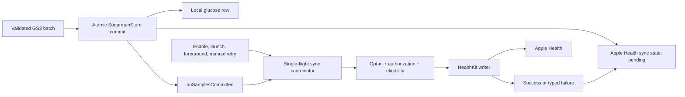

# Apple Health glucose sync implementation plan

## Status and scope

- Planning base: GitHub `origin/main` at
  `c73ae37996e18c240c1fee89cd235845e96a8a8f` (2026-09-02).
- Implementation base: freshly fetched GitHub `origin/main` at
  `53bacef16be1444e51eafef39a421aabb48a4482` (2026-09-04).
- Implementation status: source, migration, release-only app wiring, and host
  verification are complete. Physical acceptance and product eligibility are
  intentionally still open.
- Product target: the release `Sugarman` iOS app only.
- Direction: Sugarman writes eligible glucose samples to Apple Health. It does
  not import glucose from HealthKit.
- User control: off by default and enabled only from an explicit in-app action.
- History behavior: enabling the feature syncs all eligible locally retained
  history, then saves eligible new and backfilled readings.
- Delivery boundary: this plan does not enable HealthKit writes. The current
  physical-validation gates remain prerequisites.

The Device Test, Probe, Mac Device Test, synthetic demo, and package tests must
never write glucose to a user's Health store.

## Goal

Give an athlete a trustworthy, durable, one-way export of Sugarman glucose
history to the Apple Health blood-glucose type. A reconnect, repeated sensor
history batch, app relaunch, or retry after interruption must still produce
exactly one HealthKit object for each immutable Sugarman sample key.

The user-visible result is:

1. The user chooses **Save Glucose to Apple Health** in Sugarman.
2. Sugarman explains that it will save all eligible local history and future
   readings, then presents Apple's authorization sheet.
3. After authorization, eligible samples appear in Apple Health with their
   sensor timestamps and Sugarman as the source app.
4. Sugarman shows a privacy-safe status and offers a manual retry when work is
   pending or paused.
5. Turning the feature off stops future writes. It does not remove data already
   saved to Apple Health.

## Non-goals

- Reading glucose, insulin, medication, nutrition, or other health data from
  HealthKit.
- Using Apple Health as Sugarman's primary database or as a BLE durability
  boundary.
- Bidirectional conflict resolution.
- Writing workouts or associating glucose samples with workouts.
- Deleting previously written Apple Health samples when the user deletes local
  Sugarman data. Health is a separate user-controlled store; the UI must state
  this before local deletion.
- Retrofitting pre-validation samples whose stored quality is not `.ok`.
- Uploading Health data, sync state, or authorization state to a server.
- Claiming that an Apple Health save makes a reading clinically validated.

## Current repository state

The implementation must extend, rather than bypass, the current boundaries:

| Area | Current state on the planning base | Consequence |
| --- | --- | --- |
| Domain identity | `GlucoseSample.id` is `(sessionID, sensorIndex)` | Use this stable immutable key to derive the HealthKit sync identifier. |
| Local durability | `SugarmanStoring.commitSamples` atomically inserts a batch and advances the durable sensor cursor | HealthKit work begins only after this transaction succeeds. |
| Live callback | `GS3ForegroundSessionCoordinator` calls `onSamplesCommitted` after the store commit | The callback may trigger a drain, but must not carry or perform the HealthKit transaction. |
| Integration seam | `HealthKitGlucoseWriting` exists, but only `DisabledHealthKitWriter` is implemented | Keep a writer protocol and replace the placeholder with an iOS adapter plus test doubles. |
| Product guard | `HealthKitWritePolicy.glucoseWritesEnabled` is `false` | Replace the single Boolean with explicit eligibility and evidence-revision gates; never merely flip it. |
| Sample quality | `V3NativeStateClassifier` always returns `.unvalidated`, which persists as `.questionable` | No sample produced by current main is eligible to write. A separately reviewed physical-state mapping must first produce `.ok`. |
| App configuration | Health usage strings exist, but they say writes are disabled; the release entitlement does not include HealthKit | Add the capability and accurate purpose text only to the release target. |
| UI | `PrivacyView` owns local retention, export, and deletion controls | Add the Apple Health controls here, isolated from Device Test builds. |

The one-value physical parity result in
[`V3_FIRST_LIVE_READING_RESULT_2026-08-30.md`](V3_FIRST_LIVE_READING_RESULT_2026-08-30.md)
does not complete the healthy/error state mapping or the full durability gate.
Existing `.questionable` records therefore remain visible locally but are not
silently promoted or exported.

## Apple API contract

Use only Apple's public HealthKit API:

- Confirm Health data is available with `HKHealthStore.isHealthDataAvailable()`.
- Request write authorization only for
  `HKQuantityType.quantityType(forIdentifier: .bloodGlucose)`. Pass an empty
  read set.
- Treat completion of the authorization request as completion of the prompt,
  not proof that permission was granted. Read the write status with
  `authorizationStatus(for:)` before saving.
- Create `HKQuantitySample` values in `mg/dL` from Sugarman's canonical integer
  `milligramsPerDeciliter` value. Use `sensorTimestamp` as both `start` and
  `end`; never substitute `receiptTimestamp`.
- Supply both `HKMetadataKeySyncIdentifier` (a `String`) and
  `HKMetadataKeySyncVersion` (an `NSNumber`).
- Save bounded arrays with `HKHealthStore.save(_:)`. HealthKit documents a
  multi-object save as all-or-nothing.
- Do not request background-delivery or observer-query privileges. Sugarman is
  a writer, and its durable local outbox already provides recovery.

Primary references:

- [Blood glucose quantity type](https://developer.apple.com/documentation/healthkit/hkquantitytypeidentifierbloodglucose)
- [Authorizing access to health data](https://developer.apple.com/documentation/healthkit/authorizing-access-to-health-data)
- [`HKMetadataKeySyncIdentifier`](https://developer.apple.com/documentation/healthkit/hkmetadatakeysyncidentifier)
- [`HKMetadataKeySyncVersion`](https://developer.apple.com/documentation/healthkit/hkmetadatakeysyncversion)
- [Protecting user privacy](https://developer.apple.com/documentation/healthkit/protecting-user-privacy)

## Architecture

### Durable flow



The BLE coordinator must remain independent of HealthKit. A HealthKit outage,
denial, or slow save must never roll back a sensor sample, block cursor
advancement, or cause a BLE reconnect.

### Components

#### Module boundary

Keep the portable `HealthKitGlucoseWriting` protocol and disabled adapter in
`Sources/Integrations`, but put every import and use of the HealthKit framework
in a new `AppleHealthIntegration` Swift package target. The new product depends
on `Integrations`, `SugarmanDomain`, and `SugarmanStore` and is linked only by
the release `Sugarman` app. `SugarmanDeviceTest`, `SugarmanProbe`, and
`SugarmanMacDeviceTest` must not link the product.

This target boundary is the primary negative control. Do not depend only on a
runtime Boolean or `#if SUGARMAN_DEVICE_TEST` to prevent a test build from
reaching a user's Health store.

#### `AppleHealthGlucoseWriter`

An actor in `Sources/AppleHealthIntegration` owns the `HKHealthStore` and all
HealthKit objects. It implements a narrow protocol that supports:

- Health data availability;
- write authorization request and current write status;
- construction and atomic save of one bounded glucose batch.

Keep `HKHealthStore` actor-isolated for Swift 6 concurrency. Hide HealthKit
behind a small client protocol so coordinator tests can use deterministic
fakes. Unsupported platforms use the disabled implementation; non-release app
targets do not link this module at all.

The writer validates each input again before constructing an `HKQuantitySample`:

- quality is `.ok`;
- decoder revision is in the reviewed allowlist;
- the sample is not synthetic/demo data;
- the value is positive and representable in the chosen HealthKit unit;
- the timestamp is not unreasonably in the future according to a documented
  clock-skew tolerance and is no earlier than
  `healthStore.earliestPermittedSampleDate()`.

Do not attach a sensor serial, account reference, CoreBluetooth UUID, raw
packet field, session metadata, or custom glucose metadata. Do not manufacture
an `HKDevice` association until the app has a separately verified, non-sensitive
session-to-device provenance model. HealthKit already records Sugarman as the
source app.

#### Stable identifier and version

Version 1 uses:

```text
syncIdentifier = "app.sugarman.glucose.v1:<lowercase-session-uuid>:<sensor-index>"
syncVersion    = 1
```

`sessionID` is an app-generated session UUID, not a sensor serial or account
identifier. Keep the identifier builder pure and unit tested.

`HKMetadataKeySyncVersion` is an integer data revision, not the string
`decoderRevision`. The current domain model treats a sample key as immutable
and fails closed on a conflicting value, so every initial object is version 1.
A future correction feature must first add an explicit local correction model
and monotonically increment this integer; it must not overload or hash the
decoder revision.

#### Local sync state

Persist Apple Health delivery state alongside each local glucose row so sample
insertion and outbox creation share the existing atomic store transaction. Add
fields equivalent to:

```text
appleHealthState: notAttempted | pending | synced | retryableFailure | blocked
appleHealthSyncVersion: Int
appleHealthAttemptCount: Int
appleHealthLastAttemptAt: Date?
appleHealthSyncedAt: Date?
appleHealthFailureReason: unavailable | notAuthorized | ineligible | healthKit | persistence | nil
```

Use only bounded enums and timestamps. Do not persist raw `HKError` text,
sample values, sync identifiers, or HealthKit object UUIDs in diagnostics.
The sync identifier is deterministic and can be reconstructed only while the
local sample exists.

New rows start as `pending` even when the user has not enabled Apple Health.
The coordinator simply does not drain them until opt-in. Existing rows from
the pre-feature schema are interpreted as `notAttempted` and reconciled in
bounded pages after opt-in. Eligibility is evaluated before save:

- eligible `notAttempted`/`pending` rows are attempted;
- transient failures become `retryableFailure`;
- denied or unavailable HealthKit pauses the drain without discarding work;
- permanently ineligible rows become `blocked` with a bounded reason;
- `synced` rows are never selected again for the same sync version.

Add an explicit SwiftData versioned schema and migration plan before adding
these fields. Test migration from a fixture created with the current schema;
do not rely only on an empty-store build.

`SugarmanStoring` gains HealthKit-neutral delivery methods, for example:

```swift
func appleHealthSyncCandidates(limit: Int, now: Date) async throws -> [GlucoseSample]
func recordAppleHealthAttempt(_ keys: [SampleKey], at: Date) async throws
func recordAppleHealthSuccess(_ keys: [SampleKey], version: Int, at: Date) async throws
func recordAppleHealthFailure(
    _ keys: [SampleKey],
    reason: AppleHealthSyncFailureReason,
    retryable: Bool,
    at: Date
) async throws
func appleHealthSyncSummary() async throws -> AppleHealthSyncSummary
```

Exact signatures can change during implementation, but they must preserve
batch transitions and work in the SwiftData, in-memory, and unavailable stores.

#### `AppleHealthGlucoseSyncCoordinator`

Use an actor with a single-flight `drain()` operation. It depends on the store,
writer protocol, clock, and opt-in settings; it does not depend on SwiftUI or
CoreBluetooth.

Drain behavior:

1. Exit without touching HealthKit if the product build is ineligible or the
   user opt-in is off.
2. Confirm Health data availability and write authorization.
3. Load the oldest pending/retryable eligible rows, bounded to 100 samples.
4. Build one HealthKit array and save it atomically.
5. Mark the exact keys and sync version successful in one local transaction.
6. Continue for at most five batches per invocation, then yield. A later
   trigger continues the backlog.
7. On authorization denial or Health data unavailability, pause without a
   retry loop. On transient errors, persist a bounded attempt state and use
   exponential backoff with jitter, capped at one hour. The next lifecycle or
   sample trigger may drain only after that deadline.
8. Never run two drains concurrently and never hold the local store actor
   across an awaited HealthKit call.

Trigger `drain()` after:

- successful opt-in/authorization;
- app bootstrap and transition to active;
- `onSamplesCommitted` after the local BLE transaction;
- a manual Retry action;
- a later app launch after an interrupted attempt.

The production coordinator always uses `primaryStore`, never the temporary
synthetic demo store.

### Crash and retry semantics

| Interruption point | Recovery |
| --- | --- |
| Before local sample commit | Nothing is written to HealthKit. The BLE/history path retries according to its existing durable cursor rules. |
| After local commit, before HealthKit save | The row remains pending and is selected by a later drain. |
| During an atomic HealthKit batch save | Treat the batch as pending unless HealthKit reports success. Retry with the same sync identifiers and versions. |
| After HealthKit success, before local success commit | Retry the same identifiers and versions. The sync metadata prevents a second logical Health object; verify this boundary on a physical test device. |
| After local success commit | The row is excluded from subsequent drains. |

Do not query glucose from HealthKit to repair the ledger. That would require a
read permission outside this feature's scope and would still be privacy-filtered
by HealthKit.

## Authorization and UI

Add an **Apple Health** section to `PrivacyView` in the release app only.

### States

| State | Presentation and action |
| --- | --- |
| Unsupported | Explain that Apple Health is unavailable on this device; no toggle action. |
| Off | Explain that enabling saves all eligible retained history plus future readings. Show **Save Glucose to Apple Health**. |
| Authorization not determined | A user tap shows a pre-permission explanation and then Apple's sheet. Never prompt at launch. |
| Authorized and caught up | Show enabled, last successful sync time, and no glucose value. |
| Authorized with pending work | Show a pending count, last attempt time, and Retry. |
| Denied/revoked | Show that Sugarman cannot save glucose and explain how to review Health permissions. Do not repeatedly present the system sheet. |
| Eligible-data gate closed | State that stored readings have not passed the validation required for Apple Health; do not offer a misleading successful state. |
| Temporarily failed | Keep opt-in on, show a generic retryable status, and offer Retry. |

The opt-in preference can live in app-local `UserDefaults`; authorization
remains owned by HealthKit. Requesting authorization successfully does not set
the UI to authorized—refresh `authorizationStatus(for:)` afterward.

Turning sync off prevents the next batch from starting. An atomic HealthKit
save that was already in flight may finish before the coordinator observes the
new setting; present a brief stopping state until it reaches that batch
boundary. Pending rows and previously saved Health data remain intact.
Re-enabling resumes the backlog. Local session or delete-all actions remove the
local sync state with their samples but do not remove Apple Health objects; add
that distinction to both confirmation messages.

All copy belongs in `Apps/Sugarman/Localizable.xcstrings`, including VoiceOver
labels and hints. Do not use the word “backup”: Sugarman's local store remains
authoritative, and any Apple-managed Health synchronization is outside
Sugarman's control.

## Configuration and privacy work

For the release `Sugarman` target:

1. Add the HealthKit capability in the Apple Developer identifier and signing
   profile used for `app.sugarman.ios`.
2. Add `com.apple.developer.healthkit = true` to
   `Apps/Sugarman/Sugarman.entitlements` and the matching `project.yml`
   entitlement declaration.
3. Replace `NSHealthUpdateUsageDescription` with accurate, user-facing copy,
   such as: “Sugarman saves glucose readings you choose to Apple Health so you
   can view them alongside your other health data.”
4. Keep the read request set empty. The existing workout read purpose string
   may remain for the separate future workout feature, but this implementation
   must not request that permission.
5. Add an `AppleHealthIntegration` package product only to the release target,
   then regenerate
   `Sugarman.xcodeproj/project.pbxproj` with XcodeGen.
6. Keep Device Test purpose strings and entitlements write-disabled. It must
   not link `AppleHealthIntegration`; compile the shared app/UI bridge out with
   `SUGARMAN_DEVICE_TEST`.
7. Review the privacy manifest, App Store privacy answers, product privacy
   copy, and release notes before distribution. No Health data enters local
   diagnostics, analytics, crash annotations, or network traffic.

Do not add the HealthKit background-delivery entitlement or another background
mode. The current `bluetooth-central` mode is for sensor collection, not a
license for unbounded HealthKit work.

## Implementation phases

### Phase 0 — close the data eligibility gate

1. Complete the separately defined physical evidence for healthy/error native
   state mapping and the supported decoder/firmware revision.
2. Update `V3NativeStateClassifier` so only reviewed healthy fingerprints yield
   `.ok`; unknown, warm-up, error, and unresolved states remain ineligible.
3. Record the exact evidence revision in source and documentation.
4. Add tests proving unknown revisions and synthetic samples fail closed.

Exit: production can create at least one `.ok` sample without weakening the
existing protocol, durability, or safety rules.

### Phase 1 — durable delivery state and migration

1. Add HealthKit-neutral sync status/summary types.
2. Introduce an explicit SwiftData schema version and migration plan.
3. Extend `GlucoseSampleRecord` and all store implementations with sync state.
4. Create pending state in the same transaction as every new sample.
5. Add bounded candidate and batch transition methods.
6. Preserve sync state on duplicate backfill and delete it only with its local
   sample/session.

Exit: store tests cover empty, upgraded, duplicate, conflicting, deletion, and
batch-transition cases without importing HealthKit.

### Phase 2 — HealthKit adapter

1. Keep the portable protocol/disabled fallback in `HealthKitWriting.swift`
   and create the separate `AppleHealthIntegration` target for authorization,
   identifier/quantity construction, the concrete writer, and coordinator.
2. Add the HealthKit framework and product only to the release target, plus the
   release-target capability.
3. Implement write-only authorization and typed failure mapping.
4. Implement atomic batches with stable identifier/version metadata.
5. Keep the evidence-revision eligibility policy explicit and fail closed.

Exit: adapter unit tests prove quantity, timestamp, metadata, availability,
authorization, and failure behavior; no product lifecycle calls it yet.

### Phase 3 — coordinator and lifecycle wiring

1. Implement the single-flight sync coordinator and retry policy.
2. Instantiate it with the persistent primary store in `AppModel.bootstrapped()`.
3. Trigger it after successful sample commits, opt-in, launch/foreground, and
   manual retry.
4. Keep synthetic demo and Device Test on `DisabledHealthKitWriter`.
5. Add privacy-safe status projection to `AppModel`.

Exit: deterministic tests cover concurrent triggers, bounded batches,
authorization changes, failures, cancellation, and all crash boundaries.

### Phase 4 — user experience and disclosure

1. Add the Apple Health section and confirmation flow to `PrivacyView`.
2. Add localized status, error, accessibility, and deletion copy.
3. Update the production HealthKit usage text and repository documentation.
4. Verify Dynamic Type, VoiceOver, reduced motion, and dark/high-contrast modes.

Exit: the user can understand what will be written, explicitly authorize it,
see whether it is working, turn it off, and understand the local/Health deletion
boundary.

### Phase 5 — verification and release gate

1. Run host/store tests, generate the Xcode project, and build both the release
   app and Device Test app without signing.
2. On a dedicated physical iPhone/test Health data set, verify authorization,
   value/unit/timestamp, source app, history, live writes, denial, revocation,
   relaunch, reconnect, and offline recovery.
3. Inject a development-only interruption after HealthKit success but before
   local success recording. Relaunch and verify one logical Health entry per
   Sugarman sample key.
4. Verify that Device Test, Probe, Mac Device Test, and synthetic demo perform
   zero HealthKit saves.
5. Review entitlements and the archived app's `Info.plist` from the exact
   release artifact.
6. Complete privacy/App Store review before enabling the product gate.

Exit: every acceptance criterion below has source, automated, built-artifact,
and physical-device evidence clearly separated.

## Expected file changes

| Path | Planned change |
| --- | --- |
| `Sources/Integrations/HealthKitWriting.swift` | Refine the portable protocol and retain the disabled fallback without importing HealthKit. |
| `Sources/AppleHealthIntegration/AppleHealthAuthorization.swift` | Availability, write-only authorization, and typed status. |
| `Sources/AppleHealthIntegration/AppleHealthGlucoseWriter.swift` | Quantity construction, sync metadata, and atomic save. |
| `Sources/AppleHealthIntegration/AppleHealthGlucoseSyncCoordinator.swift` | Single-flight outbox drain and retry policy. |
| `Sources/SugarmanStore/SugarmanStoring.swift` | HealthKit-neutral candidate/transition/summary operations. |
| `Sources/SugarmanStore/SwiftDataSugarmanStore.swift` | Versioned schema fields, migration, queries, and atomic status transitions. |
| `Sources/SugarmanStore/InMemorySugarmanStore.swift` | Deterministic sync-state implementation for tests/demo isolation. |
| `Sources/SugarmanStore/UnavailableSugarmanStore.swift` | Fail-closed sync operations. |
| `Apps/Sugarman/SugarmanApp.swift` | Wire release-only lifecycle/sample triggers. |
| `Apps/Sugarman/AppleHealthAppBridge.swift` | Construct the release-only coordinator and expose privacy-safe app status. |
| `Apps/Sugarman/PrivacyView.swift` | Release-only Apple Health controls and deletion disclosure. |
| `Apps/Sugarman/Localizable.xcstrings` | Permission, status, retry, accessibility, and deletion copy. |
| `Apps/Sugarman/Info.plist` | Accurate write purpose string. |
| `Apps/Sugarman/Sugarman.entitlements` | Release HealthKit entitlement. |
| `Package.swift` | Add the isolated `AppleHealthIntegration` product/target and its tests. |
| `project.yml` | Link that product and capability only in the release target; Device Test remains disabled. |
| `Sugarman.xcodeproj/project.pbxproj` | XcodeGen output only. |
| `Tests/AppleHealthIntegrationTests` | Writer/coordinator/authorization tests with fakes. |
| `Tests/SugarmanStoreTests` | Migration, outbox, duplicate, retry, and deletion tests. |
| `README.md` | Replace “writes disabled” posture only after the release gate passes. |

File splitting may be adjusted during implementation, but the dependency and
side-effect boundaries above are required.

## Automated verification matrix

### Pure integration tests

- Deterministic sync identifier for a sample key; no sensor/account identity.
- Numeric sync version is always paired with the identifier.
- `mg/dL` quantity and `sensorTimestamp` start/end are exact.
- `.questionable`, `.error`, unknown decoder, synthetic, nonpositive, future,
  and too-old samples are rejected before a HealthKit call.
- Empty input does not call HealthKit.
- Authorization request contains exactly the blood-glucose share type and an
  empty read set.
- Successful prompt completion followed by denied write status remains denied.
- A 101-sample backlog becomes batches of 100 and 1.
- Five-batch invocation limit is enforced.
- Concurrent triggers cause one writer call sequence.
- Atomic save failure marks no sample successful.
- Success followed by local ledger failure is retried with identical metadata.
- Disabled opt-in, Device Test, and demo paths call the writer zero times.

### Store and migration tests

- A new sample and pending delivery state commit together.
- A conflicting duplicate rolls back both sample and delivery changes.
- Equivalent backfill duplicates preserve `synced` state.
- Old-schema samples migrate without loss and become bounded reconciliation
  candidates only after opt-in.
- Success/failure transitions require matching keys and sync version.
- Session deletion removes local sample and delivery state.
- Delete-all removes all local delivery state.
- In-memory and SwiftData implementations return the same ordered candidates
  and summary counts.

### Build checks

```sh
swift test
xcodegen generate
xcodebuild -scheme Sugarman \
  -destination 'generic/platform=iOS Simulator' \
  -configuration Debug CODE_SIGNING_ALLOWED=NO build
xcodebuild -scheme SugarmanDeviceTest \
  -destination 'generic/platform=iOS Simulator' \
  -configuration Debug CODE_SIGNING_ALLOWED=NO build
```

Also inspect the built release app's entitlements and `Info.plist`. Inspect the
Device Test artifact to prove it has no HealthKit entitlement and retains its
write-disabled purpose text.

## Physical acceptance criteria

On an explicitly approved dedicated iPhone and Health data set:

- Apple authorization appears only after the user taps the feature control.
- The request asks to write blood glucose and does not ask to read health data.
- A physically eligible live sample appears with the exact rounded mg/dL value,
  sensor timestamp, and Sugarman source.
- Eligible backfill appears oldest first and catches up after relaunch.
- Replayed sensor history, overlapping batches, reconnect, repeated sync,
  interruption, and relaunch produce one logical Health object per
  `(sessionID, sensorIndex)`.
- Denial and later revocation cause zero new writes and do not affect local BLE
  collection or history durability.
- Turning the feature off causes zero new writes; turning it back on resumes the
  pending backlog without duplicates.
- `.questionable`, warm-up/error, unsupported-revision, and synthetic samples
  never appear in Health.
- HealthKit outage/failure never changes the BLE cursor, connection state, local
  sample count, or current-reading safety presentation.
- Local diagnostics contain only bounded status/count/timing fields—no glucose
  values, sample keys, HealthKit UUIDs, identities, or raw HealthKit errors.
- Deleting local data does not claim to delete Apple Health data, and the
  confirmation copy states that boundary.

## Release decision

Do not ship by changing `HealthKitWritePolicy.glucoseWritesEnabled` to `true`.
Ship only after all of these are true:

1. The native-state/sample-quality physical gate yields `.ok` only for a
   reviewed supported decoder/firmware revision.
2. Migration and crash-window idempotency tests pass.
3. Release and negative-control target entitlements are verified from built
   artifacts.
4. Physical HealthKit acceptance passes on the exact release source.
5. Privacy, App Store, and product copy reviews are complete.

Until then, the concrete implementation may be developed and tested behind an
empty eligibility allowlist, but production writes remain unavailable.
